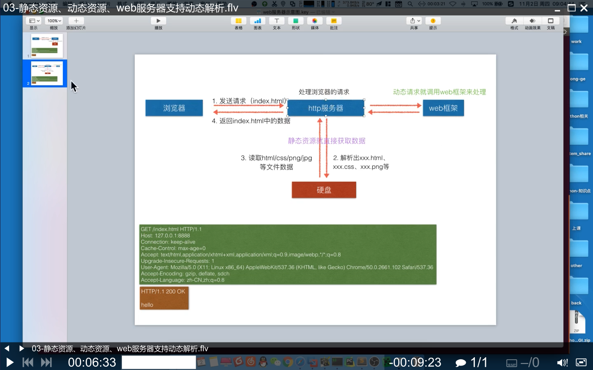

# Python3 实现 Mini-Web 框架（包含 Web 服务器）

通过版本迭代，实现一个简单的 Mini-Web 框架

原理：浏览器 <===> Web 服务器 <===> Mini-Web 框架

## 文件命名说明

- 文件：`版本号 + 补充的功能.py` ---> Python 实现的简易 Web 服务器
- 文件：`mini_frame + 版本号.py` ---> Python 实现的简易 Mini-Web 框架
- 文件夹：`版本号 + 补充的功能` ---> 按文件夹归档的新版本（包括 Web 服务器和 Mini-Web 框架）
