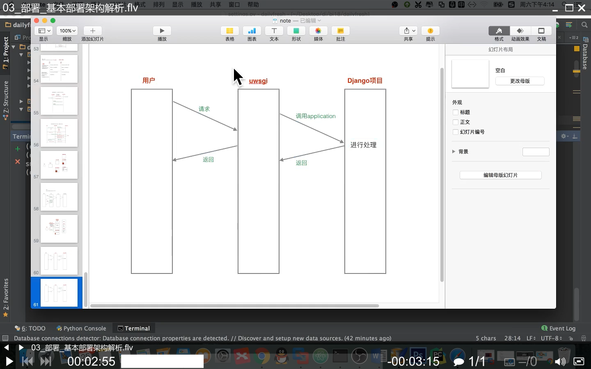
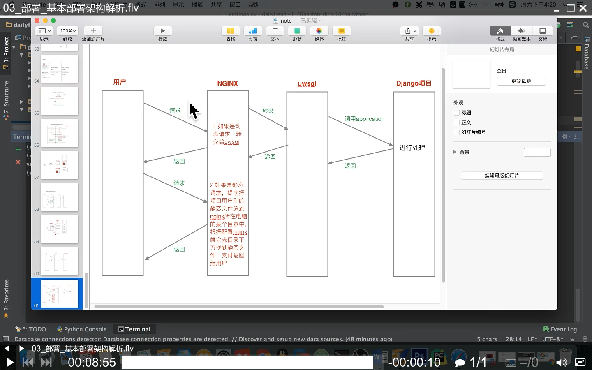
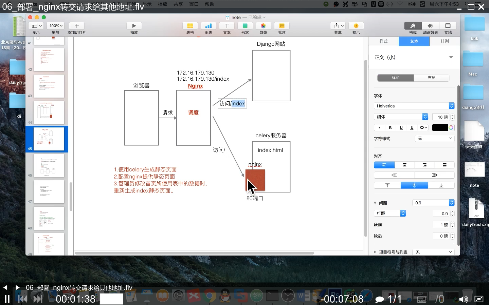
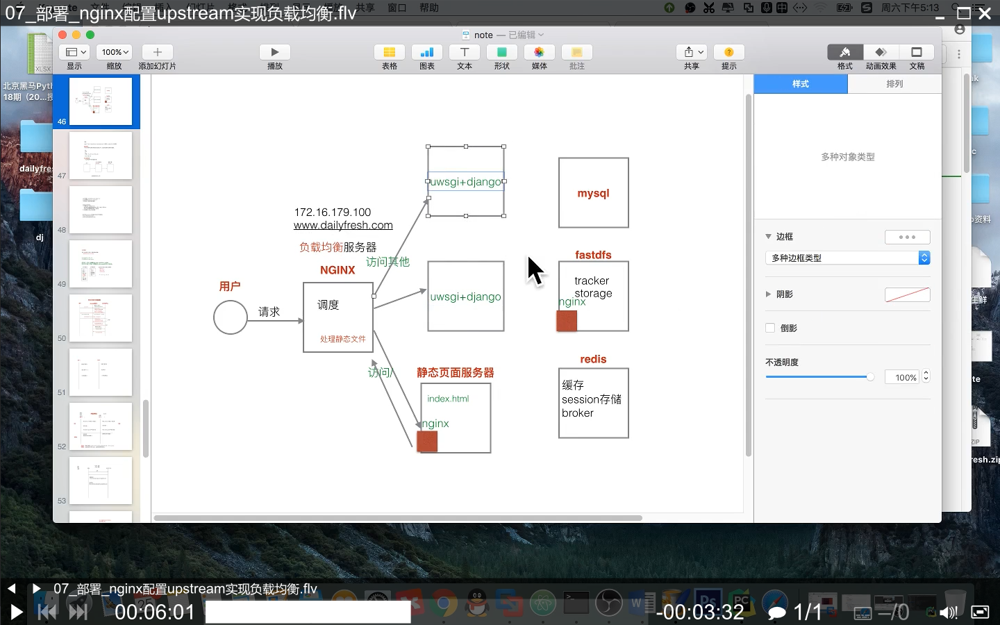

# 07

部署到 Ubuntu 20.04 机器上

## 部署

### 架构一

部署架构为：MySql 和 Redis 服务端在 Windows 电脑上，Django 项目、FastDFS➕Nginx 以及任务执行者 celery 在 Ubuntu 电脑上

拷贝项目所有文件 `dailyfresh\` 到 Ubuntu 上，然后执行如下

``` bash
cd 07部署/
sudo apt-get install python3-venv  # 安装这个后下一个命令才不会报错
python3 -m venv virtual_env  # 创建虚拟环境
source ./virtual_env/bin/activate  # 激活并进入虚拟环境
pip3 install django
pip3 install django-tinymce  # 富文本
pip3 install mysqlclient  # django使用mysqlclient，弃用pymysql
pip3 install Pillow  # 模型类中使用了ImageField，所以安装这个
pip3 install itsdangerous  # 签名加密
pip3 install celery  # 异步处理，任务队列，加入/执行任务到redis
pip3 install redis  # 安装redis客户端
pip3 install django-redis  # 使用Redis作为Django缓存和session存储后端
pip3 install fdfs_client_py34  # .\utils\fdfs\storage.py使用第三方包来上传文件到fastdfs
pip3 install django-haystack  # 全文检索框架
pip3 install whoosh  # 搜索引擎
pip3 install six  # six包的bug解决参考05商品模块相关功能
pip3 install python-alipay-sdk  # 支付宝API第三方SDK
deactivate  # 退出虚拟环境
```

由于 MySql 和 Redis 服务端在 Windows 电脑上，所以修改项目的配置 `./dailyfresh/settings.py` 中对应的 IP 和端口（`DATABASES` `CACHES`），FastDFS 依然存储在该 Ubuntu 上，配置中的 `FDFS_URL` 不变，不用 `jieba` 包分词，所以 `HAYSTACK_CONNECTIONS` 引擎换成 `whoosh_backend`

接着修改 `./celery_tasks/tasks.py` 中的 Redis 链接信息，改为 Windows 的 IP 地址

启动测试

``` powershell
mysqld.exe --console --bind-address=0.0.0.0  # 由于需要Ubuntu局域网访问，所以不默认绑定127.0.0.1
redis-server.exe .\redis.conf  # 其中的配置文件内容为 bind 0.0.0.0
```

``` bash
cd dailyfresh/
python3 manage.py rebuild_index  # 重建搜索索引
python3 manage.py runserver
celery -A celery_tasks.tasks worker --loglevel=info  # Linux下任务处理者开始监听

sudo service fdfs_trackerd start  # FastDFS
sudo service fdfs_storaged start
sudo /usr/local/nginx/sbin/nginx  # Nginx为FastDFS提供web访问，以及托管生成的静态首页index.html
```

### 架构二

`python manage.py runserver` 只用于开发环境运行此项目，实际部署时使用遵循 WSGI 协议的 Web 服务器。由于在 Windows 下安装 `pip install uwsgi` uwsgi 服务器会出错，故在 Linux 下部署



``` bash
pip3 install uwsgi  # 安装web服务器，在Linux下部署，Windows安装此包会出错
```

1. 修改项目配置文件 `settings.py`

   ``` python
   DEBUG = False
   ALLOWED_HOSTS = ['*']
   ```

2. 然后项目根目录下创建配置文件 `uwsgi.ini`，内容如下

   ``` txt
   [uwsgi]
   #使用nginx连接时使用
   #socket=127.0.0.1:8081
   #直接做web服务器使用 python manage.py runserver ip:port
   http=127.0.0.1:8080
   #项目目录
   chdir=/home/vm/桌面/07部署/dailyfresh/
   #项目中wsgi.py文件的目录，相对于项目目录
   wsgi-file=dailyfresh/wsgi.py
   #指定启动的工作进程数
   processes=4
   #指定工作进程中的线程数
   threads=2
   master=True
   #保存启动之后主进程的pid
   pidfile=uwsgi.pid
   #设置uwsgi后台运行，uwsgi.log保存日志信息
   daemonize=uwsgi.log
   #设置虚拟环境的路径
   virtualenv=/home/vm/桌面/07部署/virtual_env/
   ```

3. 启动测试

   ``` bash
   uwsgi --ini uwsgi.ini  # 启动
   uwsgi --stop uwsgi.pid  # 停止
   ```

4. BUG 解决

   此时启动后，观察日志文件出现 bug

   ``` txt
     File "dailyfresh/wsgi.py", line 12, in <module>
       from django.core.wsgi import get_wsgi_application
   ModuleNotFoundError: No module named 'django'
   ```

   - 解决方法一

     换一个虚拟环境，不用 `python3 -m venv virtual_env  # 创建虚拟环境` 改用 `virtualenv venv --python=python3  # 创建名为venv的虚拟环境`

     ``` bash
     cd ~
     mkdir projects   # 测试的项目总目录
     pip3 install virtualenv
     cd projects/
     virtualenv venv --python=python3  # 创建名为venv的虚拟环境，--python：指定Python版本
     source venv/bin/activate  # 激活并进入虚拟环境
     pip3 install django django-tinymce mysqlclient Pillow itsdangerous celery redisdjango-redis fdfs_client_py34 django-haystack whoosh six python-alipay-sdk  # 安装项目依赖的包
     ```

     接着安装

     ``` bash
     pip3 install uwsgi  # 安装web服务器，在Linux下部署，Windows安装此包会出错
     ```

     然后将项目根目录下的配置文件 `uwsgi.ini` 中的虚拟路径配置为

     ``` txt
     #设置虚拟环境的路径
     virtualenv=/home/vm/projects/venv/
     ```

     `cd` 到项目根目录，并运行 `uwsgi --ini uwsgi.ini`

     > 参考：[Python系列之-Nginx+uWSGI+virtualenv多项目部署](https://juejin.im/post/5cd82e2c518825688d0aaec0)

   - 解决方法二

     不换虚拟环境，接着使用原来的虚拟环境 `virtual_env`，此时需要修该 `uwsgi.ini`，增加一个环境变量指定包的搜索路径

     ``` txt
     #设置虚拟环境的路径
     virtualenv=/home/vm/桌面/07部署/virtual_env/
     #同环境变量PYTHONPATH
     pythonpath=/home/vm/桌面/07部署/virtual_env/lib/python3.8/site-packages
     ```

     或者直接修改项目 `./dailyfresh/wsgi.py` 文件，增加一行代码 `sys.path.append("/home/vm/桌面/07部署/virtual_env/lib/python3.8/site-packages")`

     > 参考：[Django搭建及源码分析(三)---+uWSGI+nginx](https://www.cnblogs.com/fangyuan1004/p/4546567.html)
     >
     > [uwsgi 遇到 ImportError: No module named django.core.wsgi 问题](https://blog.csdn.net/hellokandy/article/details/95077960)
     >
     > <https://stackoverflow.com/questions/14194859/importerror-no-module-named-django-core-wsgi-for-uwsgi>

此时启动后访问网站，发现静态页面资源不显示（因为把 Django 配置中 `DEBUG = True` 关了），所以需要重新调整项目部署架构，使用 Nginx 托管静态资源

### 架构三

引入 Nginx 来托管 Django 项目中的静态资源



1. 首先创建静态目录 `sudo mkdir -p /var/www/dailyfresh/static/` 并赋予权限 `sudo chmod 777 /var/www/dailyfresh/static/`

2. 修改项目配置文件 `settings.py` 指定该目录

   ```python
   STATIC_ROOT = "/var/www/dailyfresh/static/"
   ```

3. 然后让 Django 将项目中所有的静态文件收集到该目录 `python3 manage.py collectstatic`

4. 修改 `uwsgi.ini` 并重启 `uwsgi`

   ``` txt
   #开启socket，让nginx连接uwsgi，关闭之前的http
   socket=127.0.0.1:808
   ```

5. 配置 Nginx

   ``` bash
   sudo vim /usr/local/nginx/conf/nginx.conf  # 配置nginx
   location / {
       # 包含wsgi的请求参数
       include uwsgi_params;
       # 转交请求给uwsgi
       uwsgi_pass 127.0.0.1:8080;
   }
   location /static {
       alias /var/www/dailyfresh/static/;
   }
   ```

   重启 Nginx `sudo /usr/local/nginx/sbin/nginx -s reload` 并访问测试

此时启动后访问网站，发现静态页面资源可以显示了。但是之前生成的「静态化首页」没有调度，无法显示，重新配置如下

### 架构四

Nginx 不但托管 Django 项目中的静态资源，而且也给出路由调度，分别调用 uwsgi 和另一个 nginx（FastDFS➕Nginx）上的「静态化首页」



在上一步的基础上，修改 nginx 配置，增加访问「静态化首页」的配置

``` bash
sudo vim /usr/local/nginx/conf/nginx.conf
# 精确匹配地址http://yourdomain.com/
location =/ {
    # 放置生成的静态化首页的nginx地址和端口
    proxy_pass http://127.0.0.1;
}
```

重启 Nginx `sudo /usr/local/nginx/sbin/nginx -s reload` 并访问测试

### 架构五

当启动多个 `uwsgi` 实例时，可以用配置 Nginx 的 `upstream` 实现负载均衡



在 nginx 配置文件 `server` 的前面增加 `upstream` 配置项

``` bash
sudo vim /usr/local/nginx/conf/nginx.conf
upstream dailyfresh {
    # 第一个uwsgi实例
    server 127.0.0.1:8080;
    # 第二个uwsgi实例
    server 127.0.0.1:8081;
}
```

然后指定 `server_name` 为 `dailyfresh`。此时访问网站时，nginx 会依此轮流调用后台的两个 uwsgi 实例

***

BUG 排查

运行 `celery -A celery_tasks.tasks worker --loglevel=info` 时发现任务执行者一端，执行 `generate_static_index_html.delay()` 任务时报错，原来忘记修改 `./templates/staic_base.html` 中的 url 反向解析，改为 `url 'user:order' 1`
